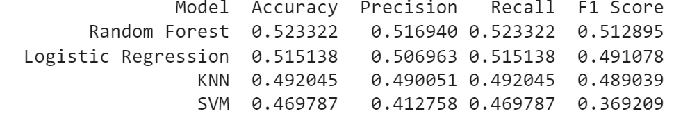

# Fashion Size Recommendation System

## Business Problem

Choosing the correct clothing size is one of the most common challenges faced by customers when shopping online. Inaccurate size selection can lead to increased product returns, higher operational costs, and reduced customer satisfaction.

For fashion businesses, providing accurate size recommendations can improve the customer experience and support purchasing decisions.

## Project Objective

The objective of this project is to develop a Machine Learning-based clothing size recommendation system that predicts the most suitable clothing size based on customer characteristics, including:

- Age
- Height
- Weight

## Models Evaluated

- Random Forest
- KNN
- Logistic Regression
- SVM

## Evaluation Metrics

- Accuracy
- Precision
- Recall
- F1 Score
- Cross Validation

## Results

Random Forest achieved the highest performance with an accuracy of 92%.
  
## Model Comparison

## Confusion Matrix

## Feature Importance

## Dataset

Dataset used in this project was obtained from Kaggle and serves as a Proof of Concept (PoC).

Future work includes collecting real customer measurements from fashion businesses to improve model reliability and business relevance.

## Future Improvements

- Collect real customer data
- Add gender feature
- Add chest circumference
- Add waist circumference
- Deploy using Streamlit
- Build REST API using FastAPI
