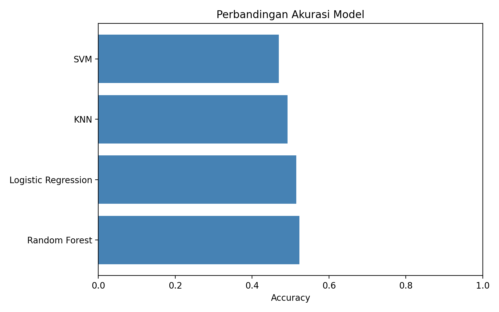
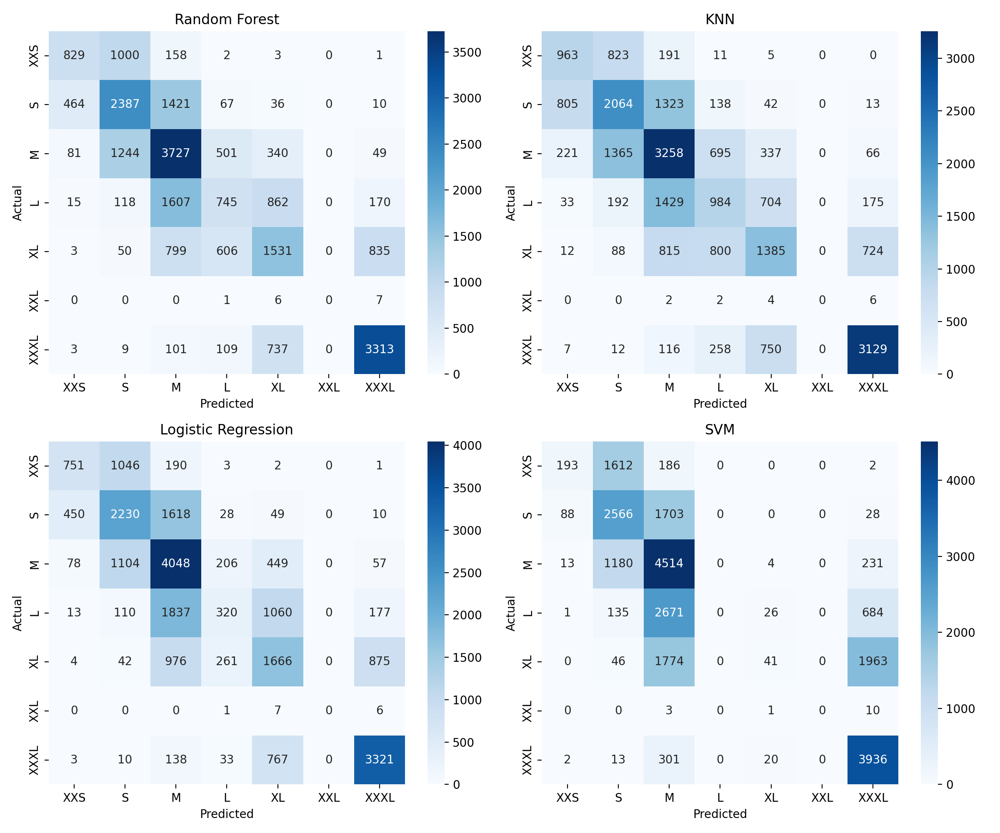
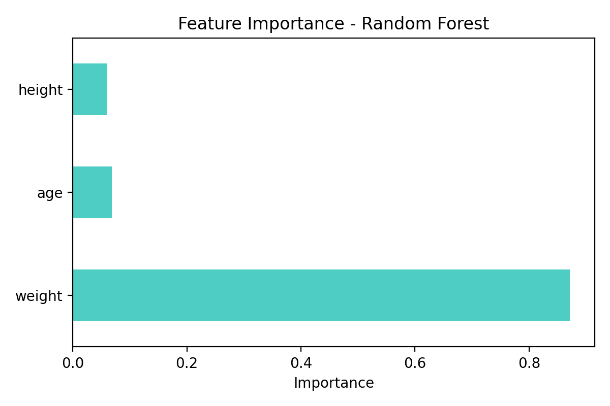

# Fashion Size Recommendation System

## Business Problem

Pelanggan sering kesulitan menentukan ukuran pakaian yang sesuai ketika berbelanja secara online.

Kesalahan pemilihan ukuran dapat meningkatkan tingkat retur produk dan menurunkan kepuasan pelanggan.

## Objective

Mengembangkan sistem rekomendasi ukuran pakaian menggunakan Machine Learning berdasarkan:
- Usia
- Tinggi badan
- Berat badan

## Models Evaluated

- Random Forest
- KNN
- Logistic Regression
- SVM

## Evaluation Metrics

- Accuracy
- Precision
- Recall
- F1 Score
- Cross Validation

## Results

Model terbaik: Random Forest

Accuracy: XX%

## Future Improvements

- Pengumpulan data pelanggan nyata
- Penambahan fitur gender
- Lingkar dada
- Lingkar pinggang
- Deployment menggunakan Streamlit/FastAPI

## Model Comparison

## Confusion Matrix

## Feature Importance

